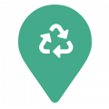
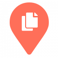
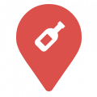
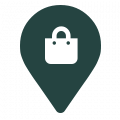

# Map marker icons

## Mixed


```https://cdn.mapmarker.io/api/v1/font-awesome/v5/pin?size=120&background=%2343AA8B&icon=fa-recycle&color=%23FFFFFF&voffset=0&hoffset=1&```

## Paper


```https://cdn.mapmarker.io/api/v1/font-awesome/v5/pin?size=120&background=%23FF6F59&icon=fa-copy-solid&color=%23FFFFFF&voffset=0&hoffset=1&```

## Glass (new)


```https://cdn.mapmarker.io/api/v1/font-awesome/v5/pin?size=120&background=%23DB504A&icon=fa-wine-bottle&color=%23FFFFFF&voffset=0&hoffset=1&```

## Plastic


```https://cdn.mapmarker.io/api/v1/font-awesome/v5/pin?size=120&background=%23254441&icon=fa-shopping-bag&color=%23FFFFFF&voffset=0&hoffset=1&```

## Add new bin


```https://cdn.mapmarker.io/api/v1/pin?size=60&background=%23254441&icon=fa-exclamation-triangle&color=%23FFFFFF&voffset=0&hoffset=1&```

## Add new bin v2


```https://cdn.mapmarker.io/api/v1/pin?size=60&background=%23F1BFBD&icon=fa-exclamation-triangle&color=%23000000&voffset=0&hoffset=1&```